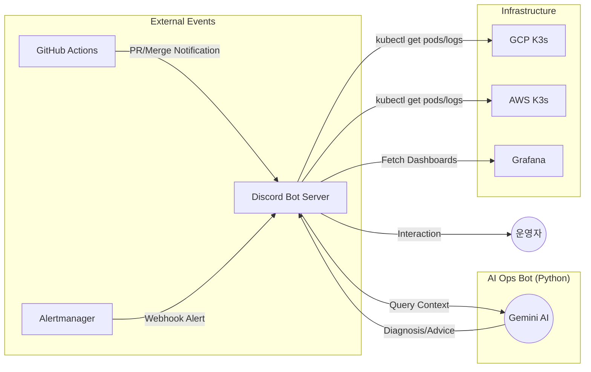

# AI Ops Discord Bot

Google Gemini AI를 활용하여 인프라 상태를 진단하고, Prometheus 알람을 Discord로 전송 및 대화형 조치를 지원하는 지능형 운영 봇입니다.

---

## 주요 기능

1.  **지능형 알람 진단**: Alertmanager로부터 수신한 알람을 Gemini AI가 분석하여 원인과 해결 방안을 제안합니다.
2.  **대화형 인프라 제어**: Discord 슬래시 명령어를 통해 K8s 클러스터(GCP/AWS)의 상태를 조회하거나 로그를 확인할 수 있습니다.
3.  **실시간 모니터링 연동**: Grafana 대시보드 링크 및 Prometheus 메트릭과 연동되어 시각적인 진단을 보조합니다.
4.  **PR 알림 (Webhook)**: GitHub Actions와 연동되어 코드 변경 사항(PR 생성/머지)을 실시간으로 채널에 공지합니다.

---

## 작동 아키텍처



---

## 디렉토리 구조

```text
aiops/discord-bot/
├── bot.py              # Discord 봇 메인 로직 (Gemini SDK, Discord.py)
├── Dockerfile          # 봇 컨테이너 이미지 빌드 설정
└── requirements.txt    # Python 의존성 (google-genai, discord.py 등)
```

---

## 배포 및 운영

본 봇은 두 가지 경로로 운영에 참여합니다.

### 1. 이미지 빌드 & 푸시 (CI)
- `.github/workflows/build-bot.yml`에 의해 관리됩니다.
- `aiops/discord-bot/` 경로의 코드가 수정되면 자동으로 Docker 이미지를 빌드하여 Docker Hub에 푸시합니다.

### 2. 서비스 배포 (CD)
- `infra/ansible/roles/monitoring` 역할을 통해 모니터링 서버(GCP)에 Docker 컨테이너로 배포됩니다.
- **필수 환경 변수** (Ansible Vault 및 GitHub Secrets 관리):
    - `DISCORD_BOT_TOKEN`: 봇 어플리케이션 토큰
    - `GEMINI_API_KEY`: Google Gemini API 키
    - `DISCORD_CHANNEL_ID`: 알람 및 진단 결과가 출력될 채널 ID

---

## 명령어 가이드 (Discord)

- `/status`: 하이브리드 클러스터(GCP/AWS)의 전체적인 헬스체크 수행
- `/diagnose <pod_name>`: 특정 Pod의 로그를 수집하여 Gemini AI에게 장애 진단 요청
- `/logs <pod_name>`: 실시간 로그 스트리밍 확인
- `(자동)` : Alertmanager 알람 발생 시 Gemini의 분석 결과가 포함된 메시지 즉시 전송
