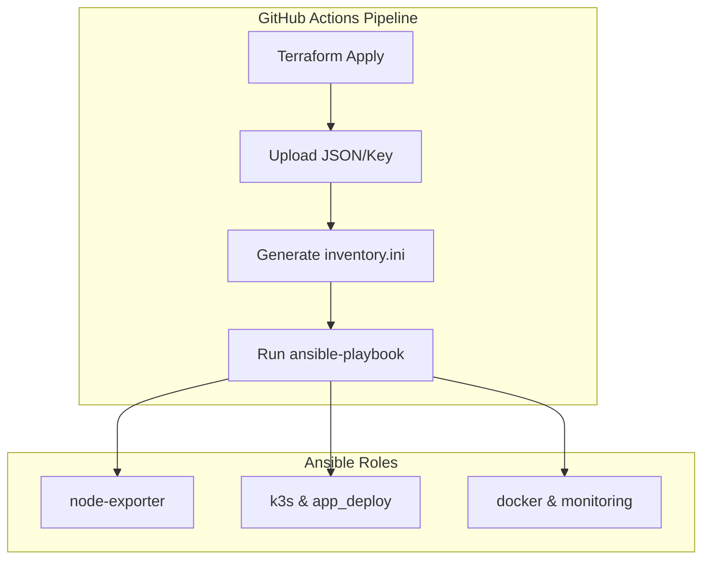

# Ansible

Terraform으로 생성된 인프라에 K3s, Docker, 모니터링 스택 및 어플리케이션을 자동으로 배포합니다.  
본 프로젝트의 설정은 **GitHub Actions** 파이프라인(`infra-deploy.yml`) 내에서 자동으로 실행됩니다.

---

## CI/CD 연동 흐름

1.  **Dynamic Inventory**: Terraform의 출력값(JSON)을 바탕으로 워크플로우 실행 시점에 `inventory.ini`를 즉석에서 생성합니다.
2.  **Artifacts**: Terraform 단계에서 생성된 DB 인증 키(`db_sa_key.json`)를 아티팩트로 전달받아 배포에 사용합니다.
3.  **App Deployment**: `app_deploy` 역할을 통해 최신 Docker 이미지를 기반으로 서비스를 배포합니다.

---

## 필수 GitHub Secrets (Ansible 전용)

인프라 구성 외에 어플리케이션 배포 및 알림을 위해 아래 Secret들이 추가로 필요합니다.

| Secret Name | 설명 |
| :--- | :--- |
| `VAULT_PASSWORD` | `group_vars/vault.yml` 복호화를 위한 패스워드 |
| `DOCKERHUB_USERNAME` | Docker Hub 사용자명 |
| `DOCKERHUB_TOKEN` | Docker Hub Access Token |
| `DOCKERHUB_REPO` | 백엔드 이미지 저장소 |
| `DOCKERHUB_REPO_BOT` | AI Ops 디스코드 봇 이미지 저장소 |
| `GEMINI_API_KEY` | AI 기능용 Google Gemini API 키 |
| `DISCORD_BOT_TOKEN` | Discord Bot 토큰 |
| `DISCORD_CHANNEL_ID` | 알림을 보낼 Discord 채널 ID |
| `DISCORD_WEBHOOK_URL` | Alertmanager 알림용 Discord Webhook URL |

---

## 설정 흐름도



---

## 디렉토리 구조

```text
infra/ansible/
├── ansible.cfg                 # SSH 파이프라이닝 및 최적화 설정
├── inventory.ini               # (CI 전용) 워크플로우 실행 시 동적 생성
├── playbook.yml                # 전체 인프라 구성을 정의한 메인 플레이북
├── group_vars/
│   ├── all.yml                 # 공통 변수
│   └── vault.yml               # 암호화된 민감 정보 (DB 접속 정보 등)
└── roles/                      # 기능별 역할 분리
    ├── prerequisites/          # 시스템 커널 및 패키지 최적화
    ├── k3s/                    # K3s 바이너리 설치
    ├── app_deploy/             # Helm/K8s 리소스를 이용한 앱 배포
    ├── node-exporter/          # 메트릭 수집기
    ├── docker/                 # 모니터링 노드용 엔진
    └── monitoring/             # Prometheus 스택 및 Discord Bot 배포
```

---

## 참고사항

- **Bastion 접속**: AWS 노드 접속 시 GitHub Actions Runner에서 Bastion 서버를 ProxyCommand로 경유하여 접속합니다.
- **Vault**: 민감한 설정값은 `ansible-vault`로 보호되며, 실행 시 `VAULT_PASSWORD` 시크릿을 통해 복호화됩니다.
- **App Deploy**: 백엔드 서버는 `app_deploy` 역할을 통해 GCP와 AWS 양쪽 클러스터에 배포되어 Failover를 준비합니다.

