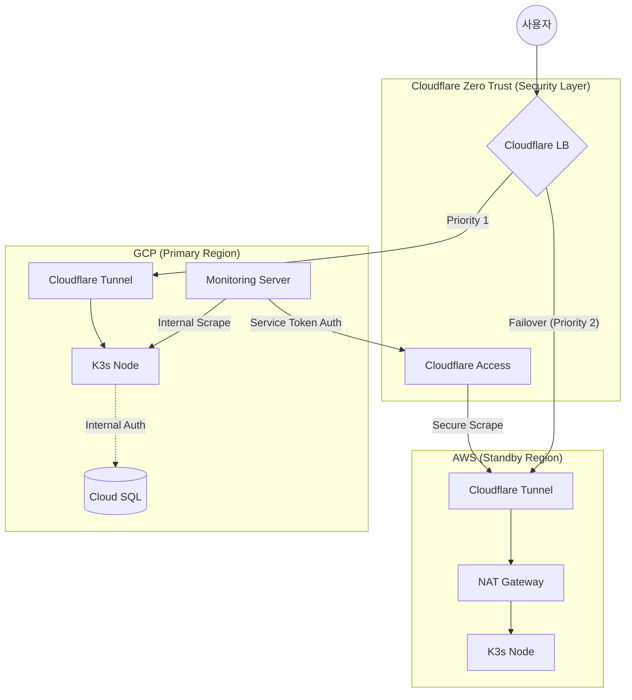

# Terraform

AWS / GCP / Cloudflare 리소스를 코드로 프로비저닝합니다.  
본 프로젝트의 인프라는 **GitHub Actions**를 통해 자동화되어 관리되며, 로컬 실행보다는 CI/CD 파이프라인을 통한 배포를 권장합니다.

---

## CI/CD 워크플로우 (GitHub Actions)

인프라 배포는 `.github/workflows/infra-deploy.yml`에 의해 수행됩니다.

1.  **Terraform Provisioning**: 클라우드 리소스를 생성하고, 필요한 출력값(IP, 토큰 등)을 JSON 형태로 저장합니다.
2.  **Artifact Upload**: 생성된 JSON 데이터와 DB 인증 키를 다음 단계(Ansible)로 전달하기 위해 GitHub Artifact로 업로드합니다.
3.  **Ansible Deployment**: 업로드된 데이터를 기반으로 `inventory.ini`를 동적 생성하여 서버 설정을 수행합니다.

### 실행 방법

1.  GitHub Repository의 **Actions** 탭으로 이동합니다.
2.  **Infrastructure Provision & App Deploy** 워크플로우를 선택합니다.
3.  **Run workflow** 버튼을 클릭하여 수동으로 실행합니다. (GCP Active-> AWS Failover 아키텍처가 구성됩니다.)

---

## 필수 GitHub Secrets

워크플로우 실행을 위해 아래 Secret들이 GitHub Repository에 등록되어 있어야 합니다.

| 구분 | Secret Name | 설명 |
| :--- | :--- | :--- |
| **Common** | `PROJECT_NAME` | 프로젝트 식별자 (GCS 버킷 명칭 등에 사용) |
| | `ENVIRONMENT` | 배포 환경 (예: production, staging) |
| **GCP** | `GCP_PROJECT_ID` | GCP 프로젝트 ID |
| | `GCP_CREDENTIALS` | GCP 서비스 계정 JSON 키 전체 내용 |
| | `GCP_DB_PASSWORD` | Cloud SQL root 비밀번호 |
| | `SSH_GCP_KEY_PUB` | GCP VM 접속용 SSH 공개키 |
| | `SSH_GCP_KEY` | GCP VM 접속용 SSH 개인키 |
| **AWS** | `AWS_ACCESS_KEY_ID` | AWS Access Key |
| | `AWS_SECRET_ACCESS_KEY` | AWS Secret Key |
| | `AWS_REGION` | AWS 리전  |
| | `AWS_KEY_NAME` | AWS EC2 Key Pair 이름 |
| | `SSH_AWS_KEY` | AWS VM 접속용 SSH 개인키 |
| **Cloudflare** | `CF_API_TOKEN` | Cloudflare API 토큰 (DNS, Tunnel 관리 권한) |
| | `CF_ACCOUNT_ID` | Cloudflare 계정 ID |
| | `CF_ZONE_ID` | Cloudflare Zone ID |
| | `CF_TUNNEL_SECRET` | 터널 암호화용 시크릿 (Base64) |
| **Monitoring** | `DISCORD_CF_BOT` | Cloudflare Load Balancer 알림용 Discord Webhook |

---

## 아키텍처 및 보안 흐름



---

## 디렉토리 구조

```text
infra/terraform/
├── main.tf                     # Provider 설정 및 모듈 오케스트레이션
├── variables.tf                # 전역 변수 (Region, Instance Type 등)
├── outputs.tf                  # 인프라 프로비저닝 결과값 출력
├── terraform.tfvars.example    # 로컬 테스트용 환경 변수 템플릿
├── ansible_inventory.tf        # 로컬 실행 시 inventory.ini 자동 생성 로직
├── inventory.tpl               # inventory.ini 작성을 위한 템플릿
└── modules/                    # 클라우드별 리소스 모듈
    ├── aws/                    # VPC, NAT GW, Standby K3s 노드
    ├── gcp/                    # VPC, Cloud SQL, Primary K3s & Monitoring
    └── cloudflare/             # Tunnel, LB, DNS, Access Policy
```

---

## 리소스 삭제 (Destroy)

1.  GitHub Actions에서 **Infrastructure Destroy (Manual)** 워크플로우를 선택합니다.
2.  **Run workflow**를 클릭하고, 실수 방지를 위한 입력창에 `destroy`를 입력합니다.
3.  실행 시 모든 클라우드 리소스가 삭제됩니다. (주의: 데이터 복구 불가)
